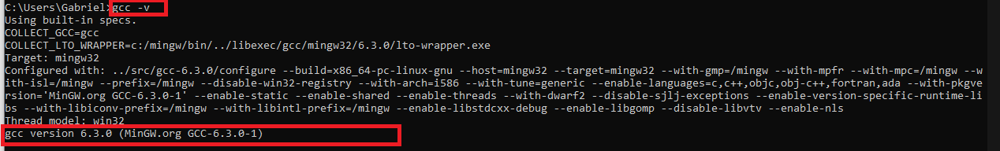

# Instrução  

Então vc caiu aqui?! :eyes: :eyes::eyes:

Alguém (professor/materia) indicou pra vc que seria legal estudar C, e vc provavelmente está pensado:  
"Poxa, deveria estar fazendo minha telinha 'HTML/CSS/JS' ou estudando uma linguagem 'mais utilizada' no mercado tipo: Java|C#|Php ...."  

Como diria o tio Zangado, calma meu jovem gafanhoto!  

Uma das belezas da linguagem C:  
É vc e o [algortimo](https://pt.wikipedia.org/wiki/Algoritmo)!  
Sem telinha, sem firula de configuração, literalmente 0 / 1; Funciona ou não funciona!    

```
Talk is cheap show me the code!  
- Linus Torvalds
```

a brincadeira aqui é resolver 300 exercícios:
[link do .pdf](https://github.com/gabrieldarezzo/300-ideias-c/blob/main/docs/300%20Ideias%20Para%20Programar%20Computadores.pdf)

# Meu primeiro programa
Ok, bora lá rodar nosso primeiro programa em C?!

Tem duas maneiras de brincar aqui: 
## 1 - Easy (Nutella)
Baixar:
https://sourceforge.net/projects/orwelldevcpp/  

Instalar, Next, Next Finish abrir o DevC++.  
Iniciar um novo projeto:   
    

Escrever o programa no arquivo que acabos de abrir:  
```c
#include <stdio.h>

int main(void) {
    printf("Meu primeiro programa em linguagem C");
    return 0;
}
```

   

Vai solicitar um local para salvar o arquivo binario/executavel, escolha/sal a gosto e após isso vai abrir automaticamente seu programa:   
      
(Seu primeiro programa em C foi executado!!! :heart_eyes: :heart_eyes: :heart_eyes: )  

## 2 - Hard (Raiz)  
o video abaixo aborda tudo:
https://www.youtube.com/watch?v=WHyxv69ZAf0  

ou:

a) Seguir o tutorial: (Método 2 | Windows)  
https://pt.wikihow.com/Compilar-um-Programa-Usando-o-Compilador-GNU-(GCC)

Garantir que ao rodar o prompt de comando:
```shell
gcc -v
```  



b) Baixar um editor de C/C++, exemplo:  
https://code.visualstudio.com/download

Criar um arquivo chamado `ola_mundo.c`
```c
#include <stdio.h>

int main(void) {
    printf("Meu primeiro programa em linguagem C");
    return 0;
}
```
[Navegue](https://youtu.be/NZKpDpHL5Bo?t=36) até a pasta do arquivo `ola_mundo.c` que vc criou, pelo terminal.

Execute o comando
```shell
gcc -o ola_mundo.exe ola_mundo.c
```
Que basicamente vai gerar um executavel chamado `ola_mundo.exe` quando finalizar a 'compilação' 

Para executar o programa simplesmente executamos o `ola_mundo.exe`
```shell
ola_mundo.exe
```

### Explicação do comando executado acima.  
Pq não podemos simplesmente rodar o `ola_mundo.c` ?  
Como o [`C` é uma linguagem que é compilada](https://pt.wikipedia.org/wiki/C_(linguagem_de_programa%C3%A7%C3%A3o)), precisamos 'traduzir' para a o sistema operacional usando o compilador gcc.

```shell
gcc -o ola_mundo.exe ola_mundo.c
```
Que basicamente vai criar/gerar um executavel quando finalizar a 'compilação' 

Para executar o programa simplesmente chamamos o binario/executavel `ola_mundo.exe`

```
gcc => Chamando o compilador, (GNU Compiler Collection) é um conjunto de compiladores de linguagens de programação produzido pelo projecto GNU para construir um sistema operativo semelhante ao Unix livre.

-o (Parametro) -o <file> Place the output into <file>.

ola_mundo.exe (Nome do arquivo binario a ser criado) (Obs: o `.exe` é opcional, o gcc sempre coloca ele se omitido.)
```

## Bonus e dicas:
Deixe sempre a exibição de extensão dos arquivos habiitados:  
https://www.youtube.com/watch?v=mdXePAIlwFM

## Compilar em (Mac/Linux)  
```shell
gcc -o run ola_mundo.c
```
Rodar o executavel:   
```shell
./run
```


